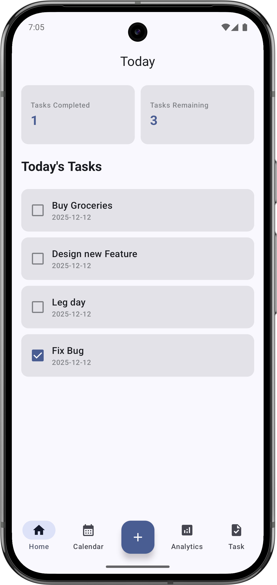
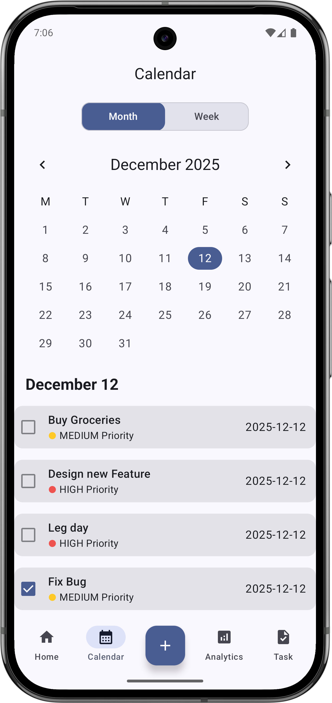
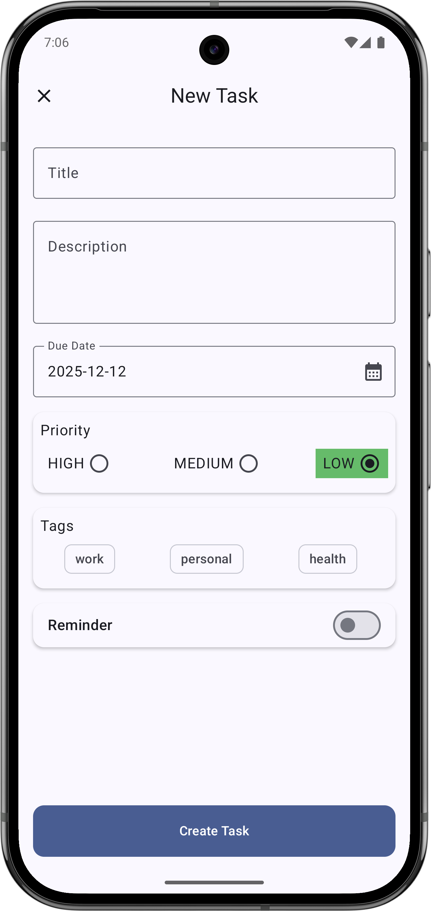
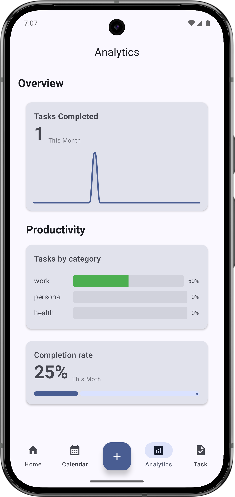
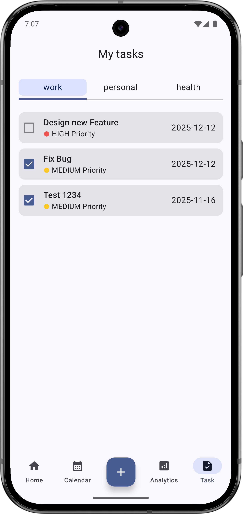

# ✈️ Task Management - Modern Offline-First Task Manager

**Task Management** is a robust, production-ready Android application designed to demonstrate the power of **Modern Android Development (MAD)**. It features a completely offline-first architecture, background data synchronization, and a beautiful UI built 100% with **Jetpack Compose**.


## 🎥 App Demo & Screenshots


### App Screenshots
|                 Dashboard                  |                 Create Task                  |               Calendar View               |
|:------------------------------------------:|:--------------------------------------------:|:-----------------------------------------:|
|  |  |  |

|               Analytics Data               |             Category Filter             |
|:------------------------------------------:|:---------------------------------------:|
|  |  |
## ✨ Key Features

*   **Offline-First Architecture:** Create, edit, and delete tasks without internet. Data syncs automatically when connection is restored.
*   **Background Synchronization:** Uses **WorkManager** to handle reliable background syncing with the remote API.
*   **Reactive UI:** Built completely with **Jetpack Compose** using `StateFlow` and Unidirectional Data Flow (UDF).
*   **Custom Data Visualization:** Features a custom-drawn Line Graph (using Canvas API) to visualize productivity.
*   **Advanced Calendar:** Interactive calendar for filtering tasks by specific dates.
*   **Task Management:** Priority tagging, reminders, and category filtering.

## 🛠 Tech Stack

The app follows **Clean Architecture** principles and the **MVVM** pattern.

*   **Language:** [Kotlin](https://kotlinlang.org/)
*   **UI:** [Jetpack Compose](https://developer.android.com/jetpack/compose) (Material 3)
*   **Local Data:** [Room Database](https://developer.android.com/training/data-storage/room)
*   **Network:** [Retrofit](https://square.github.io/retrofit/) + GSON
*   **Background Work:** [WorkManager](https://developer.android.com/topic/libraries/architecture/workmanager)
*   **Asynchronous:** Coroutines & Flow
*   **Dependency Injection:** Manual Dependency Injection (Service Locator)
*   **Navigation:** Jetpack Navigation Compose

## 🚀 Getting Started

1.  Clone the repository:
    ```bash
    git clone https://github.com/Hoodlab/Task-management.git
    ```
2.  Open the project in **Android Studio**.
3.  Sync Gradle.
4.  Run the app on an Emulator or Physical Device.

## 🎓 Learn to Build This App

This application is the capstone project for my complete Udemy course: **Modern Android Development with Kotlin and Jetpack Compose**.

If you want to learn how to build this app step-by-step, understanding the "Why" behind every line of code, check out the course here:

👉 **[Get the Full Course on Udemy](https://www.udemy.com/course/android-development-with-kotlin-and-jetpack-compose/?referralCode=1C191D33FAB7AD24130E)**

## 📄 License

This project is open-source and available under the MIT License.